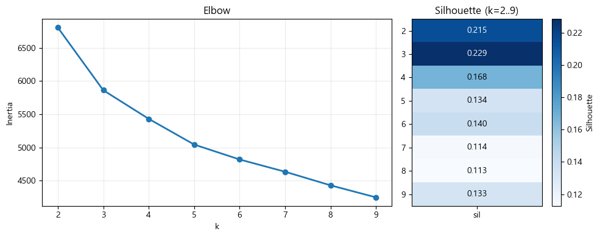
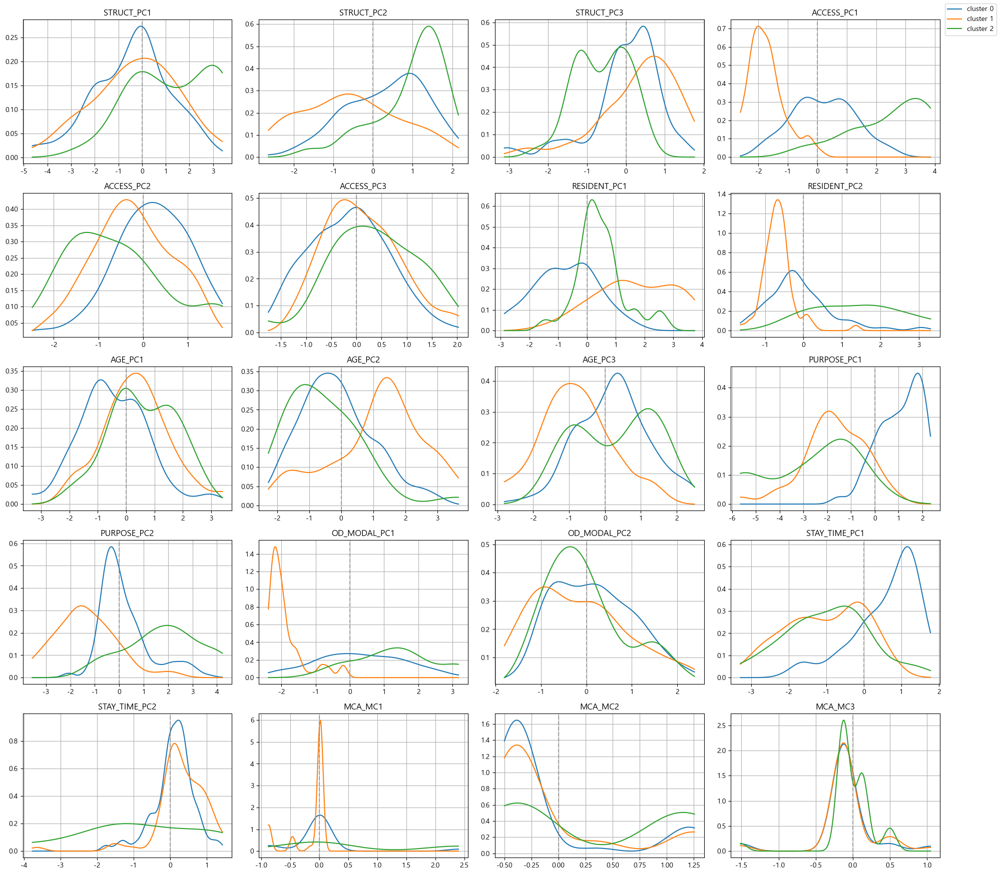
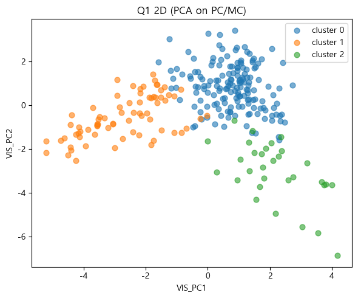
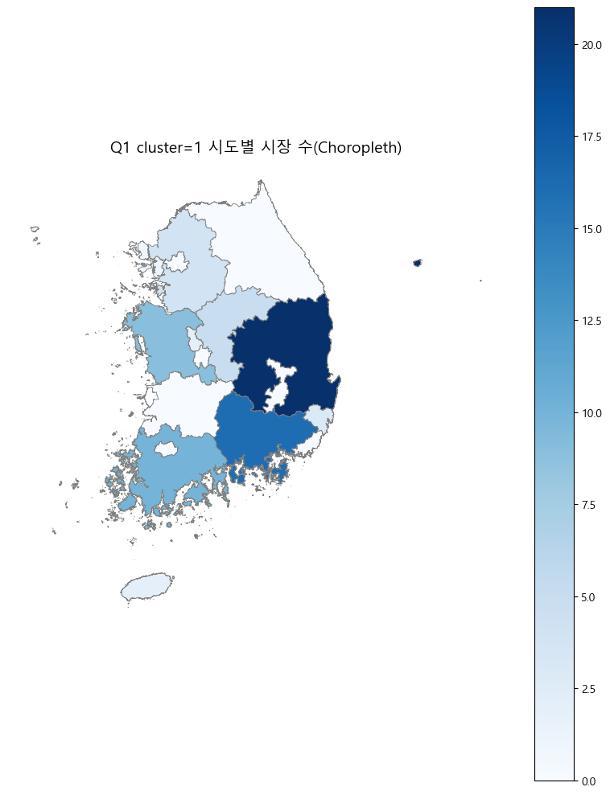
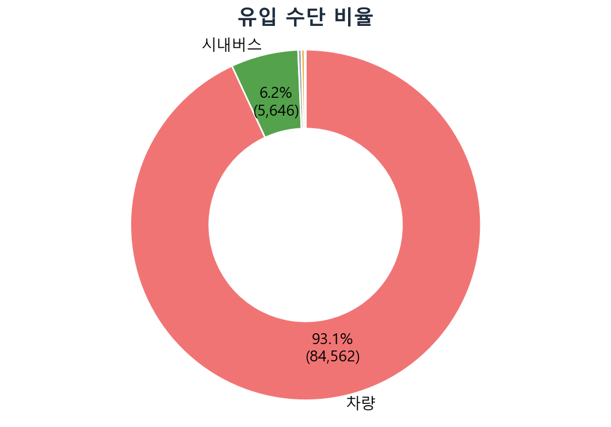
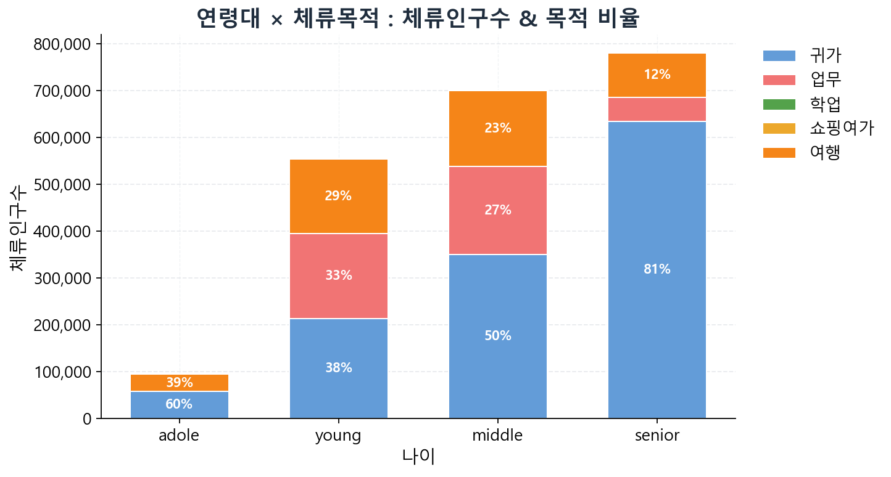
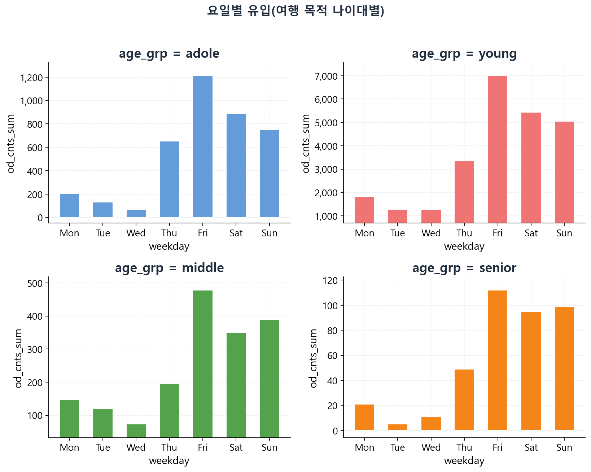
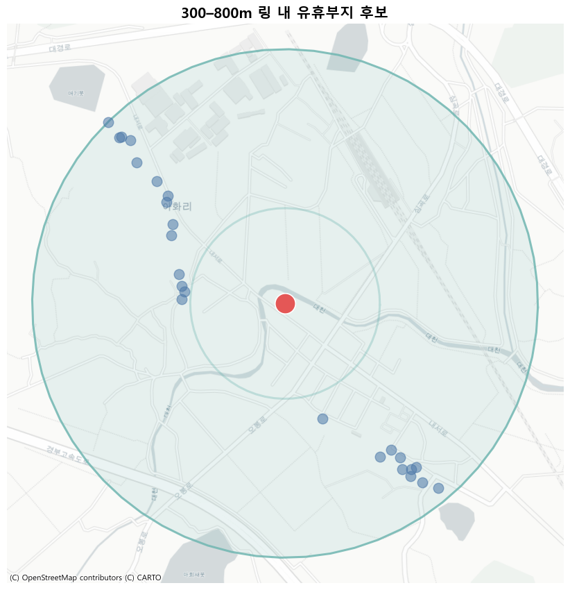
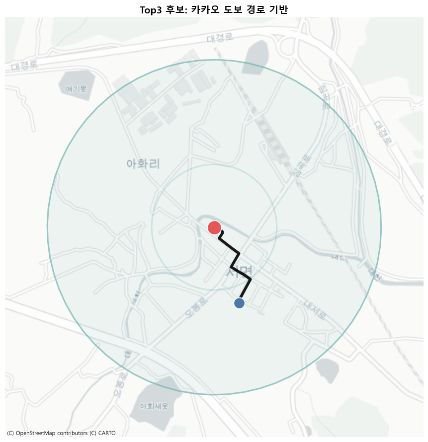
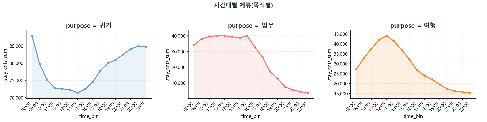

# 전통시장 활성화 분석 — 공실 위험도 진단 & 맞춤형 전략 도출

[](https://python.org)
[]()
[-lightgrey)]()
[]()

> 빅콘테스트 2024 출품 | 2인 팀 | 전국 833개 전통시장 · Q1 고위험 268개 진단 · 지원율 역전 구조 발견

---

## 🎯 핵심 발견

* Q1 고위험 시장(268개) 중 전통시장 정부 지원 사업 수혜율 8.9% — 덜 위험한 Q2 조기경보(25.9%)보다 낮아 위험도와 지원 배분이 역전된 구조를 직접 통합한 공공 데이터에서 확인
* 방문객 93.1%가 차량 이동 — 주차 인프라 부재가 방문의 물리적 장벽이며, 고위험 시장 활성화의 가장 즉각적 개선 레버로 확인
* 고령 배후 인구가 많은 Cluster 1에서 실제 방문객 중 20-30대 비중이 오히려 높게 나타남 — "고령 배후 = 노인 방문 집중" 예상이 빗나간 역설적 패턴 확인
* 전통시장 32%(268개)가 Q1 고위험 — 실제 공실 높음과 구조적 취약성이 동시에 존재하며 즉각적 지원 필요

---

## 📌 프로젝트 배경

* 전국 1,600여 개 전통시장의 빈점포율이 2020년 이후 꾸준히 상승하는 가운데, 전통시장 정부 지원 사업(시설 현대화·컨설팅·청년몰 등)이 다수 운영 중임에도 지원 후 재쇠퇴가 반복 — 빅콘테스트 2024에서 전통시장 활성화를 주제로 소상공인시장진흥공단·통계청·공공데이터포털·SKT OD/Stay 등 5개 이종 데이터를 직접 수집·통합하는 분석 과제 제시
* "어떤 시장이 얼마나 위험하며, 정부 지원이 실제로 위험한 시장에 배분되고 있는가"를 데이터로 검증하는 체계가 부재 — 여러 공공 데이터를 직접 통합하지 않으면 지원 배분 현황과 위험도를 한 테이블에서 교차 분석할 수 없는 구조
* 공실률 예측과 잔차 기반 위험 유형화, 모빌리티 행동 분석을 결합해 시장 유형별 맞춤 활성화 전략과 수치 기반 정부 지원 우선순위 재배분 방향 도출

---

## 🔍 분석 설계

**분석 질문**

공실률은 시장 면적·인프라·배후 인구 같은 구조 변수로 상당 부분 설명될 것 — 구조 변수 기반 예측 모델로 위험도를 정량화하고, 정부 지원이 위험도가 높은 시장에 집중되는지 교차 검증 가능할 것으로 예상

**검증 지표**

* XGBoost·Random Forest·LightGBM 5-Fold OOF MAE / R²
* 사분면별 정부 지원 사업 수혜율 교차 분석

**결과**

* XGBoost (MAE 0.10) 선택 — 구조 변수만으로는 공실률의 17%만 설명 가능
* 공공 메타 데이터 수집 한계로 피처 추가 성능 개선 제한적
* 사분면 교차 분석: Q1 고위험(8.9%) vs Q2 조기경보(25.9%) 역전 구조 발견

**전환점**

* 예측 정확도 향상보다 OOF 잔차(구조로 설명되지 않는 추가 위험)를 위험 신호로 전환하는 진단 프레임워크로 방향 재설정 — 예측 실패를 정보로 활용하는 접근
* 실제 공실률과 잔차를 두 축으로 하는 2×2 사분면으로 833개 시장을 유형화하고, 직접 통합한 정부 지원 사업 수혜 데이터와 교차 분석해 지원 배분의 적절성 검증

---

## ⚠️ 문제 상황

5개 이종 데이터를 직접 수집·통합하는 과정에서 세 가지 구조적 어려움 존재.

| 문제 | 내용 |
|------|------|
| 지원 배분 현황 파악 불가 | 단일 기관이 제공하는 데이터에 위험도·지원여부가 통합되어 있지 않음 — 공실률(소상공인시장진흥공단), 정부 지원 사업 수혜 여부(별도 공공 데이터), 모빌리티(SKT) 등을 직접 수집·통합해야만 지원 배분과 위험도의 관계 확인 가능 |
| 피처 수집 한계 | 기업 재무 정보·전국 편의점·마트 위치 데이터가 대외비이거나 광범위한 수집 범위로 시간·비용 초과 — 계획한 피처군 전체 확보 불가 |
| 유형화 기준 부재 | 833개 시장의 위험 수준을 진단하는 기존 방법론 없음 — 예측 잔차를 활용한 위험 유형화 프레임워크를 데이터 특성에 맞게 직접 설계 필요 |

---

## 🛠️ 분석 과정

### 1️⃣ 위험도 분류

* 5개 출처를 시장 단위(행정기관코드)로 결합
  * 소상공인시장진흥공단(시장 현황)
  * 통계청(행정동 인구)
  * 공공데이터포털(POI 6종)
  * SKT OD/Stay(모빌리티)
* 7개 피처군 구성: 시장 구조, 접근성, 배후 인구, 연령 분포, 방문 목적, 이동 수단, 체류 시간

* Stepwise + Spearman 상관 + DT/RF/XGB/LGBM 5개 기준을 fold 내에서 독립 투표
* 상위 10개 변수 선정 → 단일 기준 과적합 방지 및 fold 간 피처 일관성 확인

* KFold(n=5) OOF 방식 적용 — 전체 데이터에 대한 예측값을 fold별 비중첩 방식으로 생성해 잔차를 모든 시장에 산출. 단순 Train/Test 분리 시 잔차를 전 시장에 적용할 수 없으므로 OOF 선택
* DT·RF·XGBoost·LightGBM 4개 모델 비교 후 MAE 기준 최우수 XGBoost 채택

| 모델 | MAE | R² |
|------|-----|-----|
| XGBoost (최종) | 0.0999 | 0.170 |
| Random Forest | 0.1009 | 0.185 |
| LightGBM | 0.1018 | 0.162 |

**결과:** XGBoost (MAE 0.10) 최종 선택. R² 0.17은 구조 변수만으로는 한계 → 잔차를 위험 신호로 전환하는 진단 프레임 설계로 방향 재설정

---

### 2️⃣ 위험도 진단 & 유형화

* OOF 예측값(구조적 기대 공실률)과 실제 공실률의 차이(잔차)를 두 축으로 시장을 4개 유형으로 분류
* x축 기준: 공실률 중앙값(3.9%) / y축 기준: 잔차 0 기준

```
                  잔차 높음 (구조 초과 쇠퇴)
                         |
      Q2 잠재위험 (54개) |  Q1 고위험 (268개)
      공실 낮지만         |  실제 공실 높음 + 구조적 위험
      구조적으로 취약     |  즉각적 활성화 지원 필요
                         |
── 공실률 낮음 ──────────┼──────────── 공실률 높음 ──
                         |
      Q3 안정 (362개)    |  Q4 회복 신호 (149개)
      현재·구조 모두 안정 |  공실 높으나 잔차 낮음
                         |
                  잔차 낮음
```

* k 결정을 위해 Elbow + Silhouette 동시 평가
* k=2 시 고령·저인프라형과 광역 거점형이 미분리
* Silhouette 0.229 최고인 k=3 확정 → 클러스터 해석 가능성 확보

* risk_index = z(공실률) × 0.5 + z(잔차) × 0.5 — 절대 위험과 구조 초과 위험을 동일 가중치로 결합해 시장별 위험 순위 산출
* 정부 지원 사업 수혜 데이터와 사분면을 교차 분석
  * Q1 고위험(268개): 수혜율 8.9%
  * Q2 조기경보(54개): 수혜율 25.9%
  * 위험도와 지원 배분이 역전된 구조 확인

| 사분면 | 시장 수 | 평균 공실률 | 정부 지원 수혜율 |
|--------|---------|-----------|-----------------|
| Q1 고위험 | 268개 | 26.1% | 8.9% |
| Q2 조기경보 | 54개 | 1.6% | 25.9% |
| Q3 안정 | 362개 | 0.8% | 13.8% |
| Q4 회복 신호 | 149개 | 10.0% | 8.7% |

* Q1 268개 시장을 7개 피처군에 대해 각각 PCA(연속형) + MCA(범주형)로 차원 축소 후 결합 — 고차원 피처를 블록별로 압축해 클러스터링 품질 향상 및 해석 가능성 확보







| 군집 | 시장 수 | 피처 특성 | 핵심 대응 전략 |
|------|---------|----------|--------------|
| Cluster 0 | 164개 | 생활권 야간·일상 체류형 근린시장 | 소규모 청년몰·특화시장 조성 |
| Cluster 1 | 73개 | 고령 배후·저인프라 차량 의존형 노점시장 | 주차공간 확보 + 피크 시간대 집중 운영 |
| Cluster 2 | 31개 | 광역 집객형 대형 거점·복합 기능 시장 | 운영 방식 혁신, 온라인 채널 연계 |

**결과:** Q1(268개)과 Q2(54개)의 지원율 역전 구조 확인. Cluster 1: 고령 배후이지만 20-30대 방문객 다수 → 전략 재설계. 경북·경남·전남 지역에 집중 분포.



---

### 3️⃣ 모빌리티 분석

* SKT OD 데이터(233,428건)로 전통시장 방문객의 이동 수단, 목적, 연령별 행동 패턴 분석

* 개별 시장 특성을 보편적 패턴과 비교하기 위해 Risk Index 최고 서면시장(3.352) 선정
* Cluster 1 대표로 선정 → 분석 결과가 실제 활성화 방안으로 직결되는지 검증

* 이동 수단: 차량 93.1% — 주차 인프라가 방문의 물리적 선행 조건임을 확인



* 연령대 × 체류목적: young(20-30대)은 여행 29%·업무 33%로 활동성 높음. senior(60대+)는 귀가 81%로 생활 근린 이용 위주 — 고령 배후 시장일수록 여행객 유입이 적고 상주 수요에 의존하는 구조



* 요일 패턴: 여행 목적 방문은 전 연령대에서 금요일 최다 — 금·토·일 오전 집중 방문 구조 확인



**케이스스터디: 경주시 서면시장 (Cluster 1, risk_index 3.352)**

위험도가 가장 높지만 정부 지원을 받지 못한 시장으로, 위의 3가지 발견(높은 차량 의존도, 목적별 시간대 분리, 청년 여행객 집중)을 모두 포함.

활성화 방안 ①: 시장 300-800m 반경 내 유휴부지를 분석해 주차 후보 부지 도출 — 카카오 도보 API로 보행 접근성 검증 후 Top1 부지 선정





활성화 방안 ②: OD Stay 데이터로 목적별 피크 시간대 구분 → 귀가(8시·21시), 여행(9-12시), 업무(8-10시) 각 피크에 맞춘 운영 전략 매핑



활성화 방안 ③: 금요일 최다 방문 + 주말 20-30대 여행 집중 패턴 — 금·토·일 오전 9-12시 노점 고정 슬롯 배정으로 청년 여행객 유입 극대화. 경주 황리단길·첨성대 동선과 연계해 여행 루트에 시장 삽입

| 발견 | 연결된 활성화 방안 |
|------|----------------|
| 차량 93.1%, 주차 부재 | 300-800m 유휴부지 주차장 입지 선정 |
| 목적별 피크 시간대 분리 | 귀가·여행·업무 시간대별 맞춤 운영 전략 |
| 금·토·일 젊은 여행객 집중 | 노점 고정 슬롯 + 경주 관광 루트 연계 |

**결과:**
* 위의 3가지 발견(차량/시간/요일)이 실제 활성화 방안으로 직결되는 구조 확인
* 분석이 정책·운영 단계로 실행 가능한 수준 달성

---

## 📊 핵심 결과

### 정부 지원 배분 vs 위험도 교차 분석

위험도와 지원 배분이 역전된 구조:
* Q1 고위험: 공실률 26.1% → 수혜율 8.9% (최저)
* Q2 조기경보: 공실률 1.6% → 수혜율 25.9% (최고)

이 결과는 단일 기관 제공 데이터에 존재하지 않는 패턴으로, 공실률·지원·모빌리티 데이터를 직접 수집·통합해야만 확인 가능. 지원이 효과 없는 이유를 데이터 기반으로 설명할 수 있는 직접 근거.

### Q1 고위험 군집 요약

| 군집 | 시장 수 | 핵심 특성 | 발견된 인사이트 |
|------|---------|---------|-------------|
| Cluster 0 | 164개 | 야간 체류 높음, 배후 인구 젊음, 생활권 근린형 | 일상 생활권 수요 중심 — 소규모 특화 콘텐츠로 체류→구매 전환 가능 |
| Cluster 1 | 73개 | 고령 배후·저인프라 차량 의존형 노점시장 | 배후 인구는 고령이지만 실제 방문객 중 20-30대 비중이 오히려 높음 — 노인 상주 수요가 아닌 외부 젊은 방문객 유입이 핵심 타겟 |
| Cluster 2 | 31개 | 대형 고접근성, 광역 집객, 복합 기능 | 집객력은 있으나 구조·운영 문제로 공실 — 운영 방식 혁신과 온라인 채널 연계 필요 |

**Cluster 1의 "고령 배후 = 노인 방문 집중" 예상이 빗나간 이유:**
* 고령 인구는 생활권 이동 반경이 좁아 해당 시장을 찾지 않음
* 오히려 외부 젊은 방문객이 유입되는 구조
* 활성화 전략을 고령 소비자가 아닌 유입 청년 방문객 기반으로 재설계 필요

### 모빌리티 핵심 지표

* 차량 93.1%(84,562건) — 주차 인프라 부재 시 방문 자체가 불가한 구조. Cluster 1(저인프라) 시장의 활성화 최우선 과제
* 고령(60대+) 귀가 목적 81% — 상주 소비 의존도 높아 외부 유입 없이는 고객 증가 한계
* 20-30대 여행 목적 29%·업무 33% — 청년 방문객은 여행·업무 동선에서 유입되므로 주말 특화 프로그램·경주 관광 동선 연계가 유효한 접근

---

## 💡 적용 가능성

* 정부 지원 사업 재배분: Q1 고위험 268개를 우선 지원 타겟으로 재편 — 현재 전통시장 정부 지원 사업의 수혜가 Q2·Q3 시장에 집중된 구조에서, risk_index 기준 하위 25%를 의무 지원 대상으로 설정하면 동일 예산 대비 정책 효율성 개선 가능
* 주차 인프라 우선 지원: 차량 의존도 93.1% 기준으로 Cluster 1 시장 반경 내 공영주차장 입지 선정을 표준화 — 유휴부지 분석 파이프라인을 타 지역 고위험 시장에 재적용 가능
* 시간대별 운영 전략 보급: OD/Stay 목적별 피크 시간대 분석을 Q1 시장 전체에 적용해 시장별 맞춤 운영 시간표 수립 지원
* Q2 조기경보 선제 모니터링: 현재 공실률은 낮지만 잔차가 높은 54개 시장에 대한 분기별 지표 추적으로 Q1 진입 전 조기 개입

---

## 📈 한계점 및 향후 연구 방향

**한계점**

* 피처 수집 한계로 R² 0.17 — 전국 편의점·마트·기업 재무 정보 등 계획 피처를 확보하지 못해 예측 설명력 제한
* 2×2 사분면 분류 기준(공실률 중앙값·잔차 0)이 데이터 특화 설계 — 타 지역·시점 적용 시 기준값 재조정 필요
* 케이스스터디가 서면시장 단일 대상 — 군집별 대표 시장 추가 케이스스터디로 전략 일반화 검증 필요

**개선 방향**

* 단기: 미확보 피처(편의점·마트 반경 카운트, 상권 활성화 지수) 추가해 예측 R² 개선 시도
* 중기: Q2 조기경보 시장 대상 분기별 공실률 추적 모니터링 시스템 구축
* 장기: risk_index 기반 지원 우선순위 알고리즘을 소상공인시장진흥공단 지원 심사 보조 도구로 연계

---

## 👥 역할

2인 팀 프로젝트

* 5개 이종 공공 데이터 수집·병합 및 7개 피처군 엔지니어링 전담
* 5-Fold OOF 공실률 예측 모델링 설계 및 잔차 기반 2×2 사분면 진단 프레임워크 직접 고안
* K-Means + PCA/MCA 군집 분석 구현 및 군집별 활성화 전략 도출
* OD/Stay 모빌리티 분석·시각화 및 서면시장 케이스스터디 수행

---

## 🔧 기술 스택

| 구분 | 기술 |
|------|------|
| 예측 모델 | XGBoost, Random Forest, LightGBM (5-Fold OOF) |
| 군집 분석 | K-Means, PCA, MCA (Multiple Correspondence Analysis) |
| 지도 시각화 | Folium, Kakao Maps API |
| 데이터 처리 | Pandas, GeoPandas, Scikit-learn, Prince |

---

## 📁 파일 구조

```text
05_bc_market/
├── code/
│   ├── data/
│   │   ├── Merged.ipynb          # 메인 데이터 병합 및 피처 엔지니어링
│   │   ├── OD_Stay.ipynb         # SKT OD/Stay 전처리
│   │   ├── Population.ipynb      # 행정동 인구 매핑
│   │   ├── Clustering1.ipynb     # 군집 탐색
│   │   └── Hdong.ipynb           # 행정동 경계 처리
│   └── modeling/
│       ├── oof_modeling.ipynb    # 5-Fold OOF 모델링 + 사분면 분류
│       ├── Clutering.ipynb       # Q1 시장 군집 분석
│       ├── Diagnosis.ipynb       # 위험도 진단
│       └── Parking_location.ipynb # 주차장 입지 분석
├── figs/                         # 시각화 이미지
└── README.md
```

---

## 📊 데이터 안내

| 데이터 | 출처 | 규모 | 주요 변수 |
|--------|------|------|---------|
| 전통시장 현황 | 소상공인시장진흥공단 | 833개 시장 | 시장 구조·지원 여부·빈점포율 |
| 행정동 연령별 인구 | 통계청 | 전국 행정동 | 연령대별 거주 인구 (4구간) |
| 공공 POI | 공공데이터포털 | 전국 6종 시설 | 주차장·버스정류장·마트·관광지·편의점·지하철 |
| OD 이동인구 | SKT (빅콘테스트 제공) | 233,428건 | 이동 수단·목적·연령대·요일 |
| Stay 체류인구 | SKT (빅콘테스트 제공) | 97,732건 | 시간대·목적·연령대·요일 |

공모전 제공 데이터(SKT OD/Stay)는 빅콘테스트 참가자 전용 — 레포에 미포함. 소상공인시장진흥공단·통계청·공공데이터포털 출처 데이터는 공개 데이터이나 용량 문제로 제외. 분석 코드와 시각화 결과만 공개.
